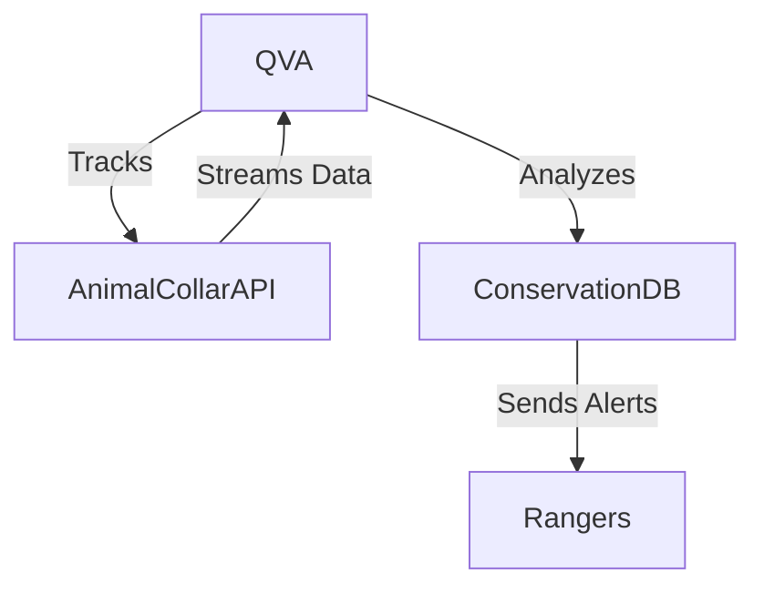

# Conservation Database Integration

This module documents QVA's integration with conservation databases for real-time animal tracking, anti-poaching alerts, and ecosystem monitoring.

## Architecture Diagram


## Example: Python Integration with a Conservation Database API
```python
import requests

def get_animal_location(api_url, collar_id, api_key):
    headers = {"x-api-key": api_key}
    response = requests.get(f"{api_url}/collars/{collar_id}/location", headers=headers)
    return response.json()

# Example usage:
location = get_animal_location("https://wildlifeapi.org", "rhino-001", "YOUR_API_KEY")
print(location)
```

## Integration Points
- **Conservation**: Real-time tracking, anti-poaching alerts, migration analysis.
- **Ecosystem Health**: Aggregate animal movement with environmental data for ecosystem insights.

## See Also
- [Conservation Module](conservation.md)
