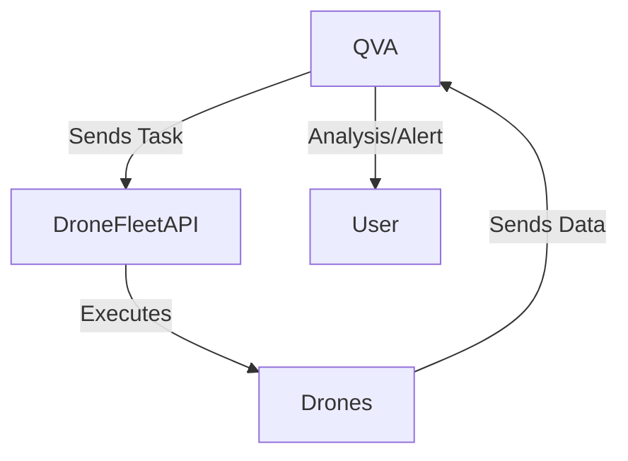

# Drone API Integration for Agriculture & Conservation

This module details how QVA automates and integrates with external drone APIs for crop monitoring, targeted intervention, and wildlife tracking.

## Architecture Diagram



## Example: Python Integration with a Drone API
```python
import requests

def send_drone_task(api_url, api_key, mission_payload):
    headers = {"Authorization": f"Bearer {api_key}"}
    response = requests.post(f"{api_url}/missions", json=mission_payload, headers=headers)
    return response.json()

# Example usage:
mission = {
    "area": "Field-42",
    "task": "NDVI_scan",
    "altitude": 30
}
result = send_drone_task("https://api.droneservice.com", "YOUR_API_KEY", mission)
print(result)
```

## Integration Points
- **Agriculture**: Automate crop health scans, pest detection, and irrigation.
- **Conservation**: Monitor animal movement, detect poaching, and map habitats.

## See Also
- [Agriculture Module](agriculture.md)
- [Conservation Module](conservation.md)
