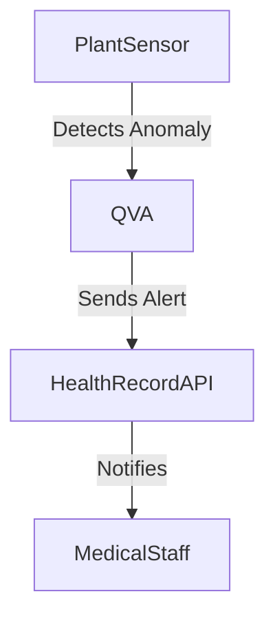

# Health Record System API Integration

This module explains QVA's integration with external health record systems (EHR/EMR) for automated medical alerts and biofeedback-driven interventions.

## Architecture Diagram


## Example: Python Integration with a Health Record API
```python
import requests

def send_medical_alert(api_url, patient_id, alert_data, api_token):
    headers = {"Authorization": f"Bearer {api_token}"}
    response = requests.post(f"{api_url}/patients/{patient_id}/alerts", json=alert_data, headers=headers)
    return response.json()

# Example usage:
alert = {
    "type": "biofeedback_anomaly",
    "message": "Elevated stress detected in biosensor data."
}
result = send_medical_alert("https://ehr.example.com/api", "patient123", alert, "YOUR_API_TOKEN")
print(result)
```

## Integration Points
- **Medicine**: Automated alerts from plant/animal biosensors to patient records.
- **Preventive Health**: Early detection and intervention using environmental and biological data.

## See Also
- [Medicine Module](medicine.md)
