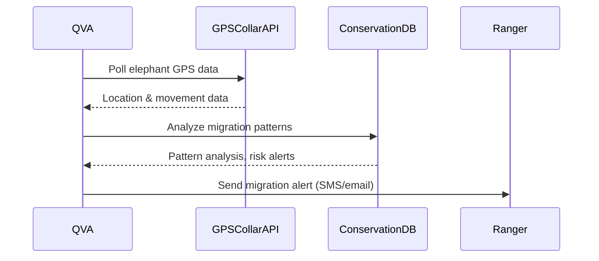

# Wildlife Tracking API Integration

This module documents QVA’s integration with commercial wildlife tracking APIs for real-time migration alerts and conservation action.

## Features
- Poll GPS collar data for elephants and other species
- Analyze migration and detect anomalies (e.g. poaching risk, habitat loss)
- Alert rangers and conservationists in real time

## Sequence Diagram


## Example Python Integration
```python
import requests

def get_gps_data(api_url, collar_id, api_key):
    headers = {"x-api-key": api_key}
    response = requests.get(f"{api_url}/collars/{collar_id}/location", headers=headers)
    return response.json()

def send_alert(ranger_contact, message):
    # Placeholder for SMS/email API
    print(f"Alert sent to {ranger_contact}: {message}")

def analyze_migration(data):
    # Placeholder for migration analysis logic
    if data['speed'] > 10:
        return "Possible distress or stampede"
    return "Normal migration"

# Workflow
if __name__ == "__main__":
    data = get_gps_data("https://api.wildlifetrack.com", "elephant-42", "YOUR_API_KEY")
    alert = analyze_migration(data)
    if alert != "Normal migration":
        send_alert("+1234567890", alert)
```

## Automated Test Example
```python
import unittest
from unittest.mock import patch

class TestWildlifeTracking(unittest.TestCase):
    @patch('requests.get')
    def test_alert_on_distress(self, mock_get):
        mock_get.return_value.json.return_value = {'speed': 15}
        from wildlife_tracking_integration import get_gps_data, analyze_migration, send_alert
        data = get_gps_data("mock_url", "mock_id", "mock_key")
        alert = analyze_migration(data)
        self.assertEqual(alert, "Possible distress or stampede")

if __name__ == '__main__':
    unittest.main()
```

## See Also
- [Conservation Module](conservation.md)
- [Conservation Database Integration](conservation_database_integration.md)
